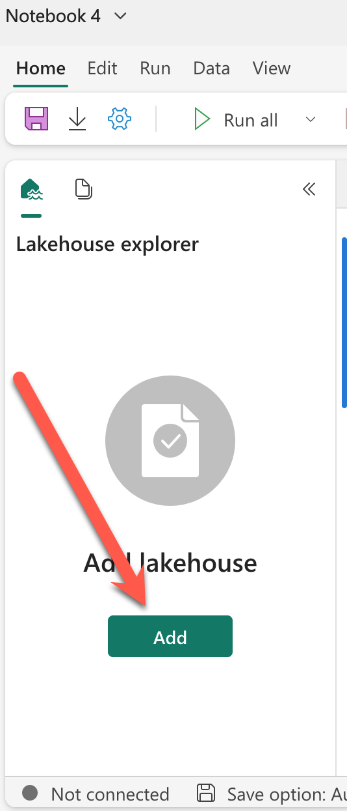
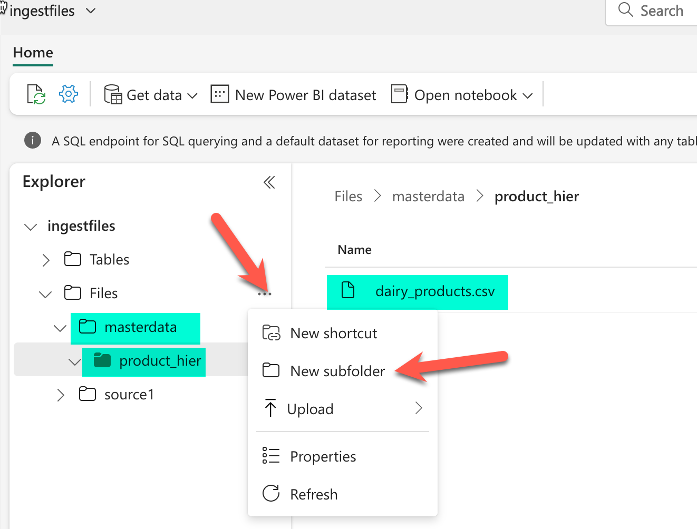

Warning:
Every time you run the Notebook the API of Azure OpenAI will be called, get familiar with those costs!


# Using OpenAI Embeddings for Data Engineering in Fabric
See a practical and simple example how you can leverage OpenAI models embedding capabilities in Data Engineering

# Not ready for production
The blog accompaining this REPO is located here and as you can see this is not production ready. Is just an example to see some pragmatic use of OpenAI embeddings in Data Engineering

# How to run the Notebook

I was running this Notebook in Fabric, since there is a 60 day trial for Fabric. You can run it in different places, you just need to adjust the first cell mainly the path in the call to pd.read_csv().

```python

# Reads the records from the last level of the hierarchy
import pandas as pd
# Load data into pandas DataFrame from "/lakehouse/default/" + "Files/masterdata/product_hier/dairy_products.csv"
df = pd.read_csv("/lakehouse/default/" + "Files/masterdata/product_hier/dairy_products.csv")
display(df)
```

## Steps
1. Create a new Notebook in Fabric. More info [here](https://learn.microsoft.com/en-us/fabric/data-engineering/how-to-use-notebook#create-a-new-notebook).

2. Add any existing lakehouse to your Notebook



3. Upload the file /resources/dairy_products to your lakehouse

More info [here](https://learn.microsoft.com/en-us/fabric/data-engineering/load-data-lakehouse#local-file-upload)

I you do not want to alter the first cell of your Notebook, then create the folder structure /masterdata/product_hier/ and upload the file in that folder.



4. You need an Azure Subscription where you have an Azure OpenAI service deployed. In that services you need to deploy a model of type text-embedding-ada-002. Make note of the name of that model deployment.

More info [here](https://learn.microsoft.com/en-us/azure/ai-services/openai/how-to/create-resource?pivots=web-portal)

5. Import the notebook [EmbedforDE.ipynb](/EmbedforDE.ipynb) into Fabric. 

More info [here](https://learn.microsoft.com/en-us/fabric/data-engineering/how-to-use-notebook#import-existing-notebooks)


6. Update this three lines in the notebook with the information from 4

```python

openai.api_base = "https://yourservicename.openai.azure.com/"
openai.api_key = "yoursecretkey" #Never share this!!!
df['vector'] = df["text_to_embedd"].apply(lambda x : get_embedding(x, engine = 'dep-ada002'))
```

In the last line just update dep-ada002, that is the name of the your deployment from step 4.


